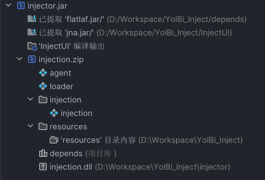

# YolBi Lite

A hot-injected client

# Warning

This repo is out-of-date.
Please move to https://github.com/yapeteam/YolBi_Lite_Recode

# Development:

Add these to ClassPath:

- /libs
- /InjectUI/jna.jar
- %JAVA_HOME%/lib/tools.jar
- Minecraft Vanilla Libs

Artifacts:

- 
- 
- 
- 

Build:

- run injector/build_as_injection.bat
- build the artifact “injector.jar”
